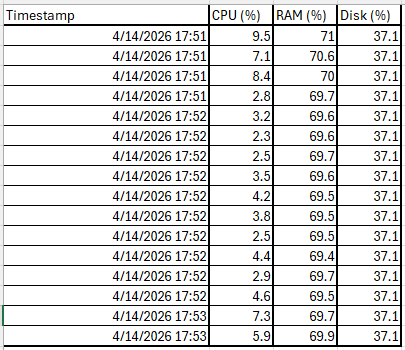

# 🖥️ System Monitoring Tool

## Overview
A lightweight Python-based system monitoring tool that tracks CPU, memory, and disk utilization in real time. The application logs system metrics into a structured CSV file and supports threshold-based alerting for basic system health monitoring.

---

## Capabilities
- Continuous monitoring of CPU, RAM, and disk usage  
- Structured logging of system metrics for analysis  
- Threshold-based alerting for resource utilization  
- Configurable monitoring intervals and limits  

---

## Tech Stack
- Python  
- psutil  

---

## Project Structure

<pre>
system_monitor/
├── monitor.py        # Main monitoring loop
├── logger.py         # Structured logging logic
├── alerts.py         # Threshold-based alert handling
├── config.py         # Configuration for thresholds
├── requirements.txt
├── README.md
└── logs/
    ├── system_log.csv
    └── system_log.png
</pre>

## Installation
cd system_monitor  
py -m pip install -r requirements.txt  

---

## Usage
py monitor.py  

The application continuously collects system metrics at defined intervals, logs them to a CSV file, and evaluates thresholds to identify abnormal resource usage.

---

## Observability Output

| Timestamp           | CPU (%) | RAM (%) | Disk (%) |
|--------------------|--------|--------|--------|
| 4/14/2026 17:51 | 9.5 | 71.0 | 37.1 |
| 4/14/2026 17:51 | 7.1 | 70.6 | 37.1 |
| 4/14/2026 17:51 | 8.4 | 70.0 | 37.1 |
| 4/14/2026 17:51 | 2.8 | 69.7 | 37.1 |
| 4/14/2026 17:52 | 3.2 | 69.6 | 37.1 |
| 4/14/2026 17:52 | 2.3 | 69.6 | 37.1 |
| 4/14/2026 17:52 | 2.5 | 69.7 | 37.1 |
| 4/14/2026 17:52 | 3.5 | 69.6 | 37.1 |
| 4/14/2026 17:52 | 4.2 | 69.5 | 37.1 |
| 4/14/2026 17:52 | 3.8 | 69.5 | 37.1 |
| 4/14/2026 17:52 | 2.5 | 69.5 | 37.1 |
| 4/14/2026 17:52 | 4.4 | 69.4 | 37.1 |
| 4/14/2026 17:52 | 2.9 | 69.7 | 37.1 |
| 4/14/2026 17:52 | 4.6 | 69.5 | 37.1 |
| 4/14/2026 17:53 | 7.3 | 69.7 | 37.1 |
| 4/14/2026 17:53 | 5.9 | 69.9 | 37.1 |

---

## System Output Snapshot

---

## Enhancements Roadmap
- Integration with notification systems (email, Slack, webhooks)  
- Centralized logging and aggregation  
- Containerization with Docker  
- Deployment to cloud environments (AWS / Azure)  
- Visualization layer for metrics (dashboard)  

---

## Author
Iftekharul Islam
